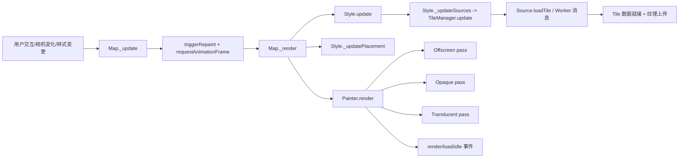

# MapLibre GL JS 渲染流程（代码级梳理）

本文基于当前仓库源码，梳理 MapLibre GL JS 的核心渲染链路。

范围：
- 主线程中的地图生命周期与帧调度
- 样式/数据源/瓦片更新流程
- Worker 侧瓦片解析流程
- Painter 多通道渲染（offscreen/opaque/translucent）
- 地形与球面投影相关分支

核心入口文件：
- `src/ui/map.ts`
- `src/style/style.ts`
- `src/tile/tile_manager.ts`
- `src/source/vector_tile_source.ts`
- `src/source/worker.ts`
- `src/source/vector_tile_worker_source.ts`
- `src/source/worker_tile.ts`
- `src/render/painter.ts`
- `src/render/render_to_texture.ts`
- `src/render/terrain.ts`

---

## 1. 总览：从变更到出帧

一句话理解：
**Map 通过 styleDirty/sourceDirty 两个“脏标记”驱动 RAF 帧循环，在一帧内批量完成样式评估、瓦片更新、符号放置与多通道 GPU 绘制，直到进入 idle。**

---

## 2. 初始化与样式装载

### 2.1 Map 构造阶段如何接线

在构造函数中，Map 把关键事件接到 `_update()`：
- `move` / `moveend` / `zoom` 触发重渲染（`src/ui/map.ts:771`、`src/ui/map.ts:772`、`src/ui/map.ts:773`）
- `terrain` 事件会标记 terrain facilitator 为 dirty 并触发 `_update(true)`（`src/ui/map.ts:774`）
- 所有 `data` 事件会进一步触发 `_update(event.dataType === 'style')`（`src/ui/map.ts:831`）

这意味着：**绝大多数状态变化最终都会汇聚到 `_update()`。**

### 2.2 setStyle 到 style.load

`setStyle()` 决定走 diff 更新还是全量替换，然后进入 `_updateStyle()`（`src/ui/map.ts:2019`、`src/ui/map.ts:2060`）。

Style 装载链路：
1. `Style.loadURL()` / `Style.loadJSON()`（`src/style/style.ts:423`、`src/style/style.ts:443`）
2. `_load(...)` 完成样式对象初始化（`src/style/style.ts:459`）
3. 创建 source/layer/light/projection/sky，并处理 terrain（`src/style/style.ts:470`、`src/style/style.ts:481`、`src/style/style.ts:483`、`src/style/style.ts:484`、`src/style/style.ts:486`、`src/style/style.ts:488`）
4. 触发 `data(style)` 和 `style.load`（`src/style/style.ts:490`、`src/style/style.ts:491`）

---

## 3. 脏标记与帧调度

### 3.1 `_update()` 做了什么

`Map._update(updateStyle?)`（`src/ui/map.ts:3506`）：
- 按需置 `this._styleDirty`
- 置 `this._sourcesDirty = true`
- 调用 `triggerRepaint()`

### 3.2 `triggerRepaint()` 的“合帧”能力

`triggerRepaint()` 保证同一时刻只有一个待执行 RAF（`src/ui/map.ts:3738`）。
多次调用不会产生多帧排队，而是合并到下一帧执行。

RAF 封装在 `browser.frame()`（`src/util/browser.ts:21`），并支持 `AbortController` 取消。

### 3.3 每帧任务队列

`_requestRenderFrame()` 可把任务挂到下一帧执行（`src/ui/map.ts:3523`），
底层由 `TaskQueue.run()` 在 `_render` 开头执行（`src/ui/map.ts:3552`、`src/util/task_queue.ts:40`）。

---

## 4. 主渲染函数 `Map._render(...)`

入口：`src/ui/map.ts:3543`

执行顺序（核心步骤）：

1. **准备状态**
   - `context.setDirty()` / `painter.setBaseState()`（`src/ui/map.ts:3549`、`src/ui/map.ts:3550`）
   - 执行 `_renderTaskQueue.run()`（`src/ui/map.ts:3552`）

2. **样式批处理（styleDirty）**
   - 构建 `EvaluationParameters`
   - 更新 zoomHistory、crossFading
   - 调用 `style.update(parameters)`（`src/ui/map.ts:3561` 到 `src/ui/map.ts:3582`）

3. **投影过渡状态同步**
   - 根据 projection transition 状态更新 transform（`src/ui/map.ts:3584` 到 `src/ui/map.ts:3586`）

4. **数据源更新（sourcesDirty 或 globe 状态变化）**
   - `style._updateSources(transform)`（`src/ui/map.ts:3591` 到 `src/ui/map.ts:3594`）

5. **地形与中心高程更新**
   - terrain tile manager 更新
   - min elevation / center elevation 更新（`src/ui/map.ts:3596` 到 `src/ui/map.ts:3608`）

6. **符号放置更新**
   - `style._updatePlacement(...)`（`src/ui/map.ts:3610`）

7. **真正绘制**
   - `painter.render(style, options)`（`src/ui/map.ts:3613`）

8. **事件与下一帧决策**
   - 触发 `render`
   - 首次 fully loaded 时触发 `load`
   - 无脏状态且不在移动时触发 `idle`
   - 仍有脏状态则继续 `triggerRepaint()`
   （`src/ui/map.ts:3623`、`src/ui/map.ts:3625`、`src/ui/map.ts:3647`、`src/ui/map.ts:3650`）

---

## 5. Style.update：一帧中的样式批处理中心

入口：`src/style/style.ts:717`

主要职责：

1. **应用积压变更**
   - 向 worker 同步 layer 变更（`src/style/style.ts:727`、`src/style/style.ts:826`）
   - source 级 reload/clear（`src/style/style.ts:730` 到 `src/style/style.ts:739`）
   - 图片/字形依赖变化处理（`src/style/style.ts:742`、`src/style/style.ts:807`、`src/style/style.ts:817`）

2. **推进过渡动画**
   - 图层 paint transition（`src/style/style.ts:745`）
   - light/sky transition（`src/style/style.ts:749`、`src/style/style.ts:750`）

3. **按当前 zoom 重新计算图层并标记 source 使用状态**
   - `layer.recalculate(...)`
   - `tileManager.used = true/false`（`src/style/style.ts:771` 到 `src/style/style.ts:774`）

4. **重算全局渲染状态**
   - `light.recalculate`
   - `sky.recalculate`
   - `projection.recalculate`
   （`src/style/style.ts:794` 到 `src/style/style.ts:796`）

要点：
**这一阶段决定了“哪些 source 在当前帧参与渲染”，直接影响后续 TileManager.prepare/update。**

---

## 6. Source 与 Tile 生命周期

### 6.1 Source 注册与事件冒泡

`Style.addSource()` 会创建 `TileManager` 并设置 parent event（`src/style/style.ts:1002`、`src/style/style.ts:1017`、`src/style/style.ts:1019`）。

事件冒泡由 `Evented.fire()` 完成（`src/util/evented.ts:141` 到 `src/util/evented.ts:147`）。

### 6.2 TileManager.update：视口瓦片维护核心

入口：`src/tile/tile_manager.ts:486`

主要工作：
- 计算 ideal 覆盖瓦片
- 触发加载/重载
- 维护 retain 集合，清理不可见瓦片
- 对 terrain 场景追加父级理想瓦片

瓦片加载完成后 `_tileLoaded()` 会发 source data 事件（`src/tile/tile_manager.ts:298`、`src/tile/tile_manager.ts:313`），
上冒到 Map 后再次触发 `_update(...)`（`src/ui/map.ts:831`），形成“数据到达 -> 下一帧”的闭环。

### 6.3 向量瓦片链路（主线程 <-> Worker）

主线程（VectorTileSource）：
- 构建 `WorkerTileParameters` 并发送 `loadTile/reloadTile`（`src/source/vector_tile_source.ts:198`、`src/source/vector_tile_source.ts:216`、`src/source/vector_tile_source.ts:227`）
- 收到结果后 `tile.loadVectorData(...)`（`src/source/vector_tile_source.ts:267`、`src/source/vector_tile_source.ts:275`）

Worker 入口：
- `src/source/worker.ts:121`（loadTile）
- `src/source/worker.ts:125`（reloadTile）

Worker 解析：
- `VectorTileWorkerSource.loadTile()` 拉取 PBF 并解析（`src/source/vector_tile_worker_source.ts:91`）
- `WorkerTile.parse()` 建桶、拉 glyph/icon/pattern 依赖并完成 symbol layout（`src/source/worker_tile.ts:63`）
- 返回 `WorkerTileResult`（`src/source/worker_tile.ts:193`）

主线程 GPU 准备：
- `tile.upload(context)` 上传 bucket/atlas 纹理（`src/tile/tile.ts:312`）
- `tile.prepare(imageManager)` 做运行期图集 patch（`src/tile/tile.ts:332`）

### 6.4 栅格与 DEM

- Raster：下载图片后直接生成/复用 texture（`src/source/raster_tile_source.ts:182`）
- Raster DEM：下载后交由 worker 解码为 DEM，再写入 `tile.dem`（`src/source/raster_dem_tile_source.ts:56`、`src/source/raster_dem_tile_source.ts:89`、`src/source/raster_dem_tile_source.ts:90`）

---

## 7. Painter 多通道渲染

入口：`src/render/painter.ts:479`

### 7.1 帧前准备

- `imageManager.beginFrame()`（`src/render/painter.ts:489`）
- 对 used 的 tileManager 执行 prepare，并收集可见坐标（`src/render/painter.ts:499` 到 `src/render/painter.ts:507`）
- terrain 开启时按需更新 depth/coords 辅助缓冲（`src/render/painter.ts:519`、`src/render/painter.ts:634`）

### 7.2 三大 pass

1. **Offscreen pass**：处理需要离屏资源的图层（`src/render/painter.ts:531`）
2. **Opaque pass**：主缓冲不透明层，自上而下（`src/render/painter.ts:565`）
3. **Translucent pass**：半透明层，自下而上（`src/render/painter.ts:580`）

此外：
- 主缓冲清屏后先画 sky（`src/render/painter.ts:554`、`src/render/painter.ts:558`）
- globe 模式末尾画 atmosphere（`src/render/painter.ts:608`）

图层分发入口：`renderLayer(...)`（`src/render/painter.ts:657`），按 layer type 路由到 `drawSymbols/drawLine/drawFill/...`。

### 7.3 裁剪与深度

- `_renderTileClippingMasks` 给每个 source 的 tile 建 stencil mask（`src/render/painter.ts:269`）
- globe 且无 terrain 时会预写球体深度（`src/render/painter.ts:590` 到 `src/render/painter.ts:596`）

---

## 8. 地形与 Render-to-Texture 分支

### 8.1 setTerrain 后发生什么

`Map.setTerrain(...)` 会：
- 创建 `Terrain`（`src/ui/map.ts:2286`）
- 创建 `RenderToTexture`（`src/ui/map.ts:2287`）
- 调整中心高程与最小高程约束（`src/ui/map.ts:2288`、`src/ui/map.ts:2289`）

### 8.2 TerrainTileManager

`TerrainTileManager.update(...)`（`src/tile/terrain_tile_manager.ts:91`）同时维护：
- DEM source tile 的更新
- 内部 RTT tile 的可渲染集合

### 8.3 RenderToTexture 的堆栈策略

`RenderToTexture` 会把 background/fill/line/raster/hillshade/color-relief 这些可贴地层按“连续区段”分 stack，
先渲到离屏 tile 纹理，再用于地形绘制（`src/render/render_to_texture.ts:16`、`src/render/render_to_texture.ts:140`、`src/render/render_to_texture.ts:197`）。

### 8.4 terrain depth/coords 辅助缓冲

`Painter.maybeDrawDepthAndCoords(...)` 依据相机矩阵变化和 terrain tile 变化决定是否重绘辅助缓冲（`src/render/painter.ts:634`）。

---

## 9. 投影切换与球面过渡

投影切换路径：
- `Map.setProjection(...)`（`src/ui/map.ts:3877`）
- `Style.setProjection(...)`（`src/style/style.ts:1685`）
- `_setProjectionInternal(...)`：创建 projection/transform 并重载 tileManager（`src/style/style.ts:1736`）
- `Map.migrateProjection(...)`：替换 painter.transform 并触发 `projectiontransition`（`src/ui/map.ts:3417`）

在每帧中，projection transition 状态会回写 transform（`src/ui/map.ts:3586`），
并影响 painter 的 globe 分支与 atmosphere 绘制（`src/render/painter.ts:497`、`src/render/painter.ts:609`）。

---

## 10. 渲染问题排查清单

1. **不出帧**
   - 看 `_update()` 是否被触发，以及 `_frameRequest` 是否成功排队（`src/ui/map.ts:3506`、`src/ui/map.ts:3738`）

2. **样式改了但画面不变**
   - 看 `_styleDirty` 是否置位、`Style.update()` 是否执行（`src/ui/map.ts:3509`、`src/ui/map.ts:3561`）

3. **瓦片长期不出现**
   - 看 source 是否被标记为 used，以及 `TileManager.update()` 是否运行（`src/style/style.ts:773`、`src/style/style.ts:1801`、`src/tile/tile_manager.ts:486`）

4. **向量瓦片请求成功但无绘制**
   - 看 worker parse 是否产出 bucket（`src/source/worker_tile.ts:193`）
   - 看主线程是否执行 `tile.upload()`（`src/tile/tile.ts:312`）

5. **地形贴图滞后/异常**
   - 看 terrain 回调是否触发 RTT 释放（`src/ui/map.ts:2290`）
   - 看 `freeRtt` 与 `maybeDrawDepthAndCoords` 是否按预期工作（`src/tile/terrain_tile_manager.ts:124`、`src/render/painter.ts:634`）

---

## 11. 一句话总结

MapLibre 的渲染主线是：**脏标记驱动 + RAF 合帧 + 样式批处理 + 源数据更新 + 符号放置 + 多 pass 绘制**，并由地形/投影分支在同一主循环中协同完成。
